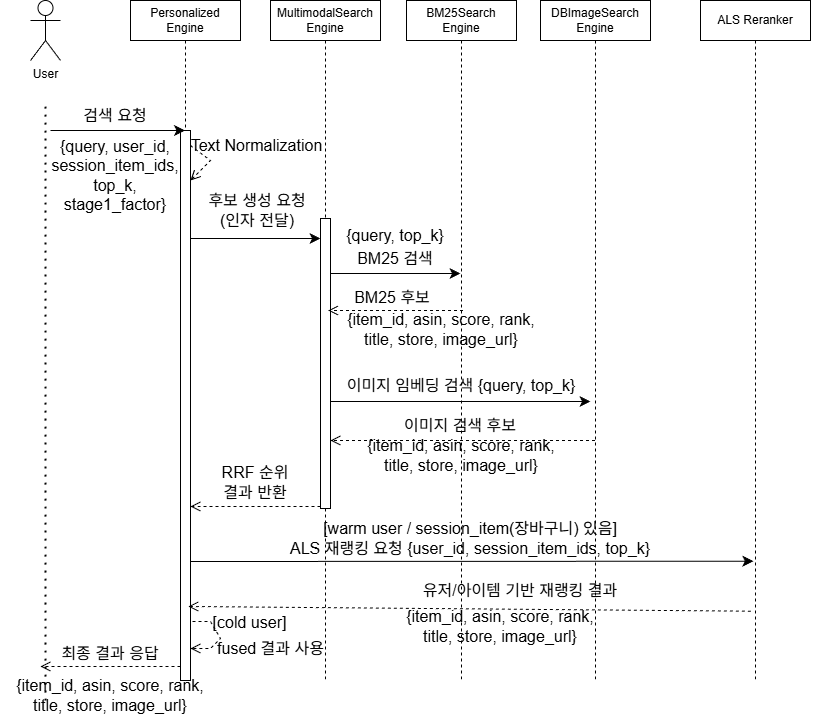

# multimodal-fashion-recommender-system
자연어와 이미지 기반으로 패션 상품을 추천하는 추천 서비스입니다.

텍스트/이미지 멀티모달 검색에 **개인화(ALS)** 를 얹어서 더 “내 취향에 맞는” 패션 아이템을 찾아주는 검색/추천 서비스입니다.

- Retrieval: **BM25(텍스트)** + **CLIP(이미지/텍스트 임베딩)**
- Vector Search: **FAISS** (이미지 임베딩 인덱스)
- Personalization: **ALS** (유저-아이템 상호작용 기반 리랭킹)
- Serving: **BentoML** API


## Key Features

- **텍스트 기반 검색**: 키워드 기반 BM25 검색
- **이미지 임베딩 기반 검색**: 이미지 임베딩(Fashion-CLIP) 기반 유사 아이템 검색
- **개인화 재랭킹**: ALS로 유저별 선호를 반영해 후보를 재정렬
- **통합 API**: 한 서비스에서 텍스트/이미지/개인화 검색을 제공


## System Overview

1. (텍스트) BM25로 후보를 찾음
2. (이미지) CLIP 임베딩 + FAISS로 후보를 찾음
3. 후보들을 합치고 점수/룰로 1차 정렬
4. 구매 경험이 있는 유저는 있으면 ALS로 **개인화 재랭킹**
5. 최종 Top-K 반환

## Tech Stack

| 구분 | 기술 |
|---|---|
| Language | Python 3.11 |
| Serving/API | BentoML |
| ML/Embedding | PyTorch |
| Multimodal Embedding | CLIP |
| Text Retrieval | BM25 |
| Vector Search | FAISS |
| Personalization | ALS (Implicit) |
| Storage | SQLite |
| Data/Utils | NumPy, Pandas |
| Container | Docker |

## Project Structure

```text
multimodal-fashion-recommender-system
├─ service/
│  └─ service.py                      # BentoML service entry (API)
├─ fashion_core/
│  ├─ als_reranker.py                  # 유저 정보로 재랭킹
│  ├─ bm25_text_engine.py              # 텍스트 후보 생성
│  ├─ db_image_engine.py               # 이미지 후보 생성
│  ├─ multimodal_search_engine.py      # 텍스트 + 이미지 임베딩 + rrf 한번에 검색하는 엔진
│  ├─ personalized_search_engine.py    # 최종 오케스트레이터(fusion 호출 + 필요 시 ALS 호출)
│  ├─ search_engine_rrf.py             # BM25 텍스트 + CLIP/FAISS 이미지 + RRF Fusion 엔진
│  ├─ search_results.py                # 결과 타입/스키마
│  ├─ search_utils.py                  # 공통 함수
├─ common/
│  ├─ als_io.py                        # ALS 학습/로딩용 데이터 IO
│  ├─ text_normalization.py            # 텍스트 검색 쿼리 전처리
```

## 서비스 아키텍처


## 시퀀스다이어그램


## 실행화면 예시


## 실행 방법 (Docker Compose)
#### 1) Clone
```bash

git clone https://github.com/LeeSY99/multimodal-fashion-recommender-system.git
cd multimodal-fashion-recommender-system
```

#### 2) Start
```bash
chmod +x scripts/fetch_assets.sh
docker compose up -d
docker compose logs -f multimodal-fashion-search
```
#### 3) Open UI
http://localhost:3000/ui/

## 운영/장애대응 실습 가이드

실무형 IT 직무 포트폴리오를 위한 운영 산출물을 추가했습니다.

- 운영 런북: `ops/runbook.md`
- Jenkins + K3s CI/CD 가이드: `ops/jenkins-k3s-cicd.md`
- 장애 리포트 템플릿: `ops/incident-report-template.md`
- Nginx 설정: `infra/nginx/fashion-search.conf`
- systemd 서비스: `infra/systemd/fashion-search.service`
- EC2 배포 스크립트: `infra/scripts/deploy_ec2.sh`
- HTTPS 자동 설정: `infra/scripts/install_nginx_ssl.sh`
- k6 부하 테스트: `loadtest/search.js`, `loadtest/README.md`
- DB 튜닝 실험: `db_tuning/README.md`, `db_tuning/postgres/`

## CI/CD 최종 상태 (Portfolio)

현재 레포는 아래 E2E 파이프라인으로 검증되었습니다.

1. Jenkins CI: pytest + coverage
2. Docker build: `ghcr.io/leesy99/multimodal-fashion-recommender-system:jenkins-<build>`
3. GHCR push: build tag + `latest`
4. K8s CD: `k8s/overlays/shared-storage` apply
5. Asset Job: `mfs-sync-assets` 완료 대기
6. Rollout 확인 후 서비스 노출

최종 확인 체크리스트:

```bash
kubectl get pods,svc,ingress,pvc -n mfs
kubectl get job mfs-sync-assets -n mfs
kubectl rollout status deployment/multimodal-fashion-recommender -n mfs
```
